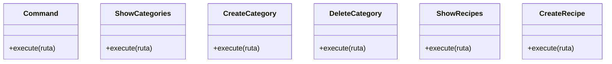

# Command (Recetas)

en esta clase pense en manejar las diferentes opciones que se pueden realizar en el sistema
por ejemplo crear una categoría, eliminar una categoría, crear una receta, eliminar una Recetas
lo que en cierta parte se puede resumir en comandos y centralizarlos en una clase

## Patron de diseño

el patrón asi como en la clase User es el patrón de diseño Command
al igual que en la clase User, el código se vuelve más modular y fácil de entender y es mucho mas flexible
