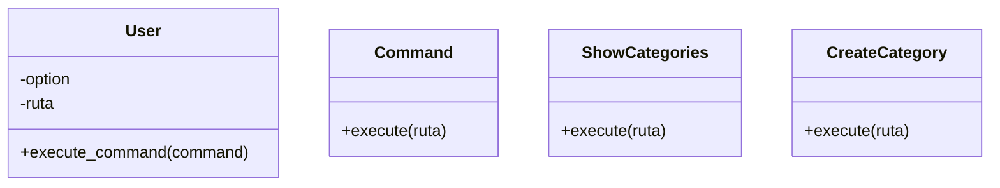

# Clase User

El principal motivo por el cual creé la clase User fue para centralizar la interacción del usuario con el sistema. En vez de tener todo el manejo del menú y las opciones dispersas, User se encarga de recibir comandos y ejecutarlos de forma organizada. Esto permite que el código sea mucho más flexible y fácil de entender.

## Patron de diseño

El primer patrón en el que pense utilizar en esta clase es el patrón de diseño Command
porque? porque el codigo se vuelve mas modular y se puede extender fácilmente si el dia de mañana
decides poner comandos adicionales solo tendrias que pasarlo por user sin tocar su implementación

> [!NOTE]
> Este patrón es muy útil en caso de que quieras crear un sistema de comandos
> y que quieras que el usuario pueda crear sus propios comandos

por aca te dejo la referencia de como se debe implementar el patrón [Patron Command](https://refactoring.guru/es/design-patterns/command)
básicamente nos permite separar la logica de negocio de la clase que ejecuta los comandos y hace que sea mucho mas ordenado

## Comandos implemntados

### ShowCategories

Muestra las categorias que tiene el usuario

### CreateCategory

Crea una nueva categoria

### DeleteCategory

Elimina una categoria

### ShowRecipes

Muestra las recetas de una categoria

### CreateRecipe

Crea una nueva receta
