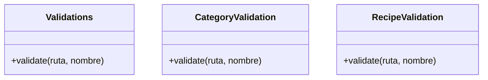

# Validations

mi proposito con esta clase fue organizar las validaciones que se realizan en el sistema
en vez de tener una funcion para cada caso, se crea una clase que se encarga de validar
cada caso y luego se llama a la clase desde el comando que se está ejecutando

## Patron de diseño

el patron de diseño que utilizo es el patrón de diseño Strategy , porque cada uno actua como una clase separada
esto nos permite que los algoritmos sean "intercambiables" de alguna manera , en este caso se tiene 2 estrategias
y las 2 clases realizan su validación dependiendo de la estrategia que se elija

te dejo la referencia de como se debe implementar el patrón [Patron Strategy](https://refactoring.guru/es/design-patterns/strategy)
